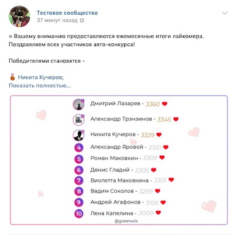

# SkyLiker - Сервис подсчета лайков в сообществе ВКонтакте

Лайкомер - сервис который поможет анализировать активность в сообществе ВКонтакте.

## Задача

Сервис должен создавать картинку топа пользователей, которые в течение месяца наиболее активно лайкали записи в сообществе, и опубликовать ее в группе ВКонтакте вместе с соответствующем текстом.

## Требования

Для работы скрипта требуется:
*  Язык: PHP (писался на версии 7.4)
*  Так же сам PHP должен включать в себя расширение GD(Graphics Library) и поддерживать Free Type
*  Если планируете запускать его через bash скрипт `start.sh`, то Binary PHP должен быть добавлен в path вашей ОС

| :memo: | Для кого-то запуск сервиса может показаться слишком сложным, поэтому будет добавлена поддежка запуска сервиса через Docker |
|--------|:---------------------------------------------------------------------------------------------------------------------------|

## Тестирование

Для тестирования необходимо зайти в директорию resources и указать в файле `config.json` свой токен и ID групп

>### Конфиг
>**token_user** - токен ВКонтакте пользоветеля
> 
>**group_id_parse** - Идентификатор группы с которого необходимо получать записи
>
>**group_id_publish** - Идентификатор группы куда будут выкладываться результаты (пользователь токена, который представлен в поле `token_user` должен иметь права редактора или выше в группе!)

Если все требования выполнены, то можно запустить скрипт на Unix подобной ОС через bash скрипт `start.sh`.

Пример работы лайкомера приведен на рисунке ниже.

## В планах

- [ ] Поддержка новой версии PHP 8.1 и выше
- [ ] Запуск в Docker
- [ ] Добавить диначеское обновление вывода в консоли
- [ ] Обновить картинку результатов лайков, которая постится в сообществе
- [ ] Обновить шрифт ибо многие символы не поддерживаются
- [ ] Вынести hard string по типу заготовленного поста в конфиг

## Автор

Copyright &copy; Андрей Агафонов, 2024

The MIT License (MIT)